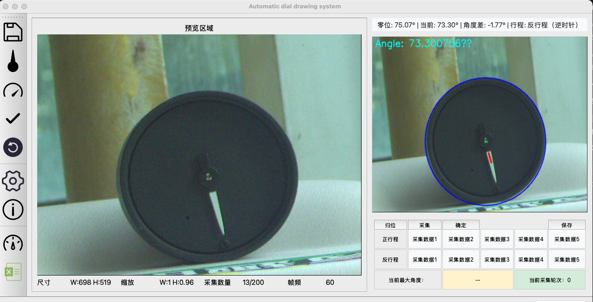

目录结构如下：
```markdown
├── CMakeLists.txt           # 项目主CMake构建文件
├── README.md                # 项目说明文件
├── src/                     # 源代码目录
│   ├── main.cpp
│   ├── data_handling/       # 数据采集和图片处理合并
│   ├── analysis/            # 图像分析和数据处理合并
│   ├── dial_rendering/
│   └── ..../
├── images/
├── ref/
├── tests/                   # 测试代码
│   ├── unit_tests/          # 单元测试
└── docs/                    # 文档
```
## 当前效果：
